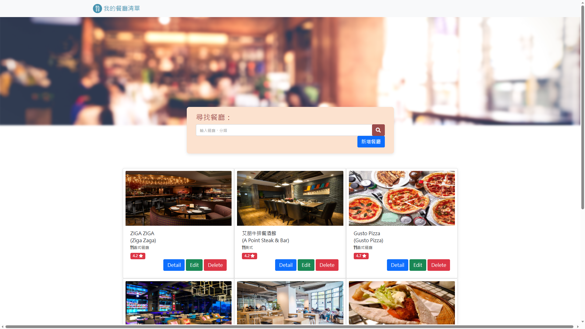

# 我的餐廳清單



## 介紹

紀錄自己的餐廳清單，可以瀏覽搜尋、查看餐廳詳細資料、連結至餐廳地圖。

### 功能

* 查看所紀錄的餐廳
* 點擊瀏覽餐廳詳細資料
* 連接餐廳Google map地址
* 搜尋特定餐廳名稱
* 新增、編輯、刪除餐廳資料


### 修正

* 首頁無法顯示評價之問題

### 優化

* 顯示店家英文名稱
* 搜尋時店家英文名稱可被搜尋

## 開始使用

1. 請先確認已安裝 node.js 與 npm

2. 接著將此專案 clone 至欲安裝之位置

   ```bash
   $ git clone https://github.com/w3i3538/RestaurantList
   ```

3. 在本地開啟之後，開啟終端機，並確認處於本專案資料夾中


4. 透過npm安裝4.18.2版本express輸入：

   ```bash
   $ npm i express@4.18.2
   ```

5. 透過npm安裝3.1.0版本express-handlebars輸入：

   ```bash
   $ npm i express-handlebars@3.1.0
   ```

6. 過npm安裝16.1.4版本的Dotenv和7.2.2版本的mongoose輸入:

   ```bash
   $ npm i mongoose@7.2.2
   $ npm i dotenv -D
   ```

7. 安裝完畢後，繼續輸入，開啟伺服器：

   ```bash
   npm run dev
   ```

8. 若看見此行訊息則代表伺服器順利運行，打開瀏覽器進入到以下網址

   ```bash
   Listening on http://localhost:3000
   ```

9. 若欲暫停使用

   ```bash
   ctrl + c
   ```

## 開發工具

- Node.js 18.16.0
- Express 4.18.2
- Express-Handlebars 3.1.0
- Bootstrap 5.2.1
- Font-awesome 5.8.1
- Dotenv 16.1.4
- Body-parser 1.20.2
- MongoDB
- mongoose 7.2.2